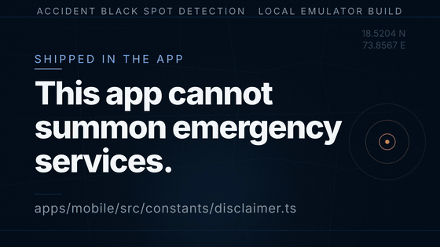
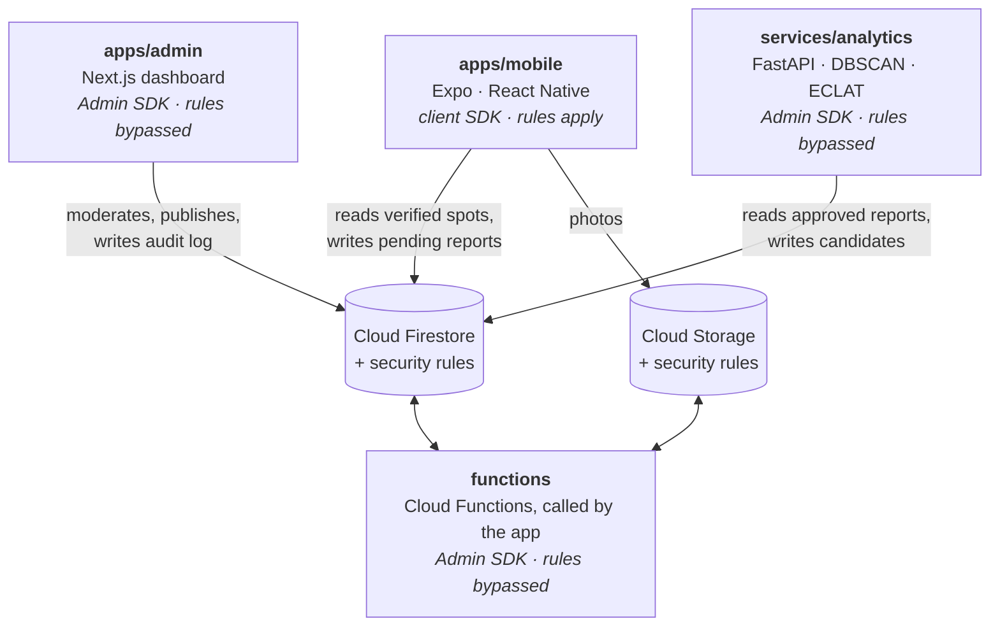
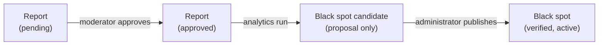

<div align="center">

# Accident Black Spot Detection

**Location-aware road-safety warnings, human-moderated incident reports and an SOS screen —
built so that no algorithm can publish a warning on its own.**

[](LICENSE)


[Quick start](#quick-start) · [Architecture](#architecture) · [Documentation](#documentation) · [Known limitations](docs/known-limitations.md)

[](video-app-walkthrough/app-walkthrough-landscape.mp4)

<sub>A designed recreation with illustrative data, not a screen recording · click for the MP4 with audio</sub>

</div>

> [!WARNING]
> **Accident Black Spot Detection provides informational warnings based on available data. It does
> not replace safe driving, emergency services or official guidance.** Black spot data is incomplete
> and partly crowdsourced — an area with no warning is not necessarily safe. The app cannot confirm
> SMS delivery, guarantee location accuracy, or summon emergency services.

## Overview

A full-stack road-safety system. A React Native app warns you as you approach an accident-prone
location, lets you report incidents, and gives you an SOS screen that reaches contacts you choose.
Behind it, a moderation dashboard keeps a human in charge of what becomes a published warning, and a
Python service clusters approved reports to _propose_ new black spots for that human to review.

It is designed around four commitments — [`docs/architecture.md`](docs/architecture.md) shows how
each one is upheld:

- **No algorithm publishes a warning.** Analytics output goes to a candidates collection the app
  cannot read and no client can write; only an administrator can publish.
- **Nobody moderates their own report**, and every privileged action is audit-logged in the same
  Firestore transaction as the change.
- **No location history is stored.** Alert logs record which black spot triggered, not where you
  were.
- **No false promises.** The app never claims to prevent accidents, contact the emergency services,
  or confirm that an SOS message was delivered.

> [!NOTE]
> All fifteen planned phases are complete, but the system has only ever run against the Firebase
> emulators — never a live project or an app store. Read
> [`docs/known-limitations.md`](docs/known-limitations.md) before drawing conclusions about
> coverage, accuracy or readiness.

## Features

**Mobile app** · Expo / React Native, iOS and Android

- Proximity warnings by banner, notification and haptics, with hysteresis and cooldowns
- Opt-in background monitoring, running the same proximity engine while the app is closed
- Offline support: cached black spots, labelled as saved rather than live, and queued draft reports
- Incident reports with up to three photos; daily limits and duplicates are enforced by the rules
- SOS with a cancellable countdown and a location message handed to the phone's SMS composer
- Nearby hospitals and police stations from OpenStreetMap, with an optional Google Places fallback
- Accessible: risk is never shown by colour alone, and contrast is checked in the test suite
- Self-service data export and account deletion

**Moderation dashboard** · Next.js — moderators work an oldest-first queue of pending reports, and
administrators also publish black spots and manage roles. Reporters appear only as salted
pseudonyms, and every privileged action is audit-logged.

**Analytics service** · FastAPI — DBSCAN clustering (haversine, 150 m, minimum 3 reports) over
approved reports, a hand-written ECLAT miner cross-validated against mlxtend's FP-Growth, and a
versioned 0–100 risk score. Its output is a candidate for human review, never a warning.

**Cloud Functions** — the four operations that genuinely need a privileged credential:
`deleteAccount`, `exportMyData`, `nearbyPlacesProxy` and `sweepOrphanedImages`.

<p align="center">
  <a href="video-app-walkthrough-vertical/app-walkthrough-vertical.mp4"></a>
  <a href="video-analytics-pipeline/analytics-pipeline-landscape.mp4"></a>
</p>

<p align="center"><sub>The phone cut and the analytics pipeline. Narration comes from strings in this repository and the algorithm parameters are real; the on-screen data is illustrative.</sub></p>

## Quick start

Everything runs against the local Firebase Emulator Suite: no Firebase account, credentials, billing
or API keys. Check the [prerequisites](#prerequisites), then install and create the environment
files — every default targets the emulators, and none contains a secret:

```bash
npm install
cp .env.example apps/mobile/.env
cp apps/admin/.env.local.example apps/admin/.env.local
cp services/analytics/.env.example services/analytics/.env
```

**Terminal 1** — start the emulators and leave them running. The Emulator UI is at
<http://localhost:4000>.

```bash
npm run emulators
```

**Terminal 2** — seed the demo data around the coordinates your simulator will report:

```bash
npm run seed:all -- 51.5074 -0.1278
```

**Terminal 3** — build and launch the app (`npm run android` for Android; the first build is slow):

```bash
npm run ios
```

Register with any email and password — the Auth emulator accepts anything — and set the simulator's
location to the seeded coordinates. You should see ten black spots with warning radii, and get a
warning as you approach one.

To file a report, first confirm your address with the command below — the security rules refuse
unconfirmed accounts, and the emulator sends no email — then tap **I have confirmed my address** on
the Report tab.

```bash
FIREBASE_AUTH_EMULATOR_HOST=127.0.0.1:9099 npm run confirm-email -- you@example.test
```

**Next:** [`docs/demo.md`](docs/demo.md) walks the dashboard and analytics service too, stating what
you should see at every step. [`docs/troubleshooting.md`](docs/troubleshooting.md) is by symptom.

## Prerequisites

No cloud account is needed. Verified on macOS 26.5 (Apple Silicon); CI runs on Ubuntu.

| Tool                                                  | Needed for                          | Tested with                   |
| ----------------------------------------------------- | ----------------------------------- | ----------------------------- |
| Node.js (`>= 20.19.4` declared) + npm                 | Everything                          | Node 24.15.0 · npm 11.12.1    |
| Firebase CLI — `npm i -g firebase-tools`              | The emulators                       | 15.2.1                        |
| JDK 21 or later                                       | The Firestore and Storage emulators | 21                            |
| Xcode with the iOS platform + CocoaPods               | iOS builds                          | Xcode 26.6 · CocoaPods 1.16.2 |
| Android SDK, platform 36, with `ANDROID_HOME` set     | Android builds                      | build-tools 36                |
| Python (`>= 3.12`) + [uv](https://docs.astral.sh/uv/) | The analytics service               | Python 3.14.6 · uv 0.9.17     |

One mobile platform is enough, but it must be a development build — Expo Go cannot register a
background task. If Xcode offers no simulators, run `xcodebuild -downloadPlatform iOS`. For
`ANDROID_HOME`, see [`docs/builds-and-releases.md`](docs/builds-and-releases.md). Watchman is
optional and speeds up Metro.

## Architecture

Four deployables share one Firestore database and nothing else. Only the mobile app uses the client
SDK, so it is the **only** component constrained by security rules; the other three use the Admin
SDK, bypass the rules, and re-check authorisation in their own code.



A report becomes a published warning only after two separate human decisions:



The trust model and data flows are in [`docs/architecture.md`](docs/architecture.md), every
collection in [`docs/data-model.md`](docs/data-model.md), and traced call chains in [`flow.md`](flow.md).

## Tech stack

| Layer     | Technologies                                                                                                          |
| --------- | --------------------------------------------------------------------------------------------------------------------- |
| Mobile    | Expo SDK 57 · React Native 0.86 · React 19.2 · Expo Router · TanStack Query 5 · React Hook Form · Zod 4               |
| Dashboard | Next.js 16 (App Router, server actions) · React 19.2 · Firebase Admin SDK                                             |
| Backend   | Firebase Auth · Cloud Firestore · Cloud Storage · Cloud Functions (Node 22) · Firebase JS SDK 12                      |
| Analytics | Python 3.12+ · FastAPI · Pydantic · scikit-learn · NumPy · uv                                                         |
| Quality   | TypeScript 6 (`strict`, `noUncheckedIndexedAccess`, `exactOptionalPropertyTypes`) · ESLint 9 · Prettier · ruff · mypy |
| Testing   | Jest + jest-expo + React Native Testing Library · `node:test` · `@firebase/rules-unit-testing` · pytest               |
| CI        | GitHub Actions: four jobs on every push and pull request, plus a weekly dependency-advisory report                    |

Versions are pinned deliberately. [ADR 0001](docs/adr/0001-platform-and-stack.md) records why each
technology was chosen and what was rejected.

## Common commands

All commands run from the repository root. [`docs/running.md`](docs/running.md) covers each in
depth.

| Command                               | What it does                                                                          |
| ------------------------------------- | ------------------------------------------------------------------------------------- |
| `npm run emulators`                   | Start the Auth, Firestore, Storage and Functions emulators; `:persist` keeps the data |
| `npm run emulators:lan`               | Expose the emulators to a physical device on your network                             |
| `npm run seed:all -- <lat> <lng>`     | Seed 12 black spots and 42 incident reports around a point                            |
| `npm start`                           | Start Metro once the development build is installed                                   |
| `npm run admin`                       | Run the moderation dashboard at <http://localhost:3000>                               |
| `npm run grant-role -- <email> admin` | Grant the first administrator, deliberately from outside the system                   |
| `npm run analytics`                   | Run the analytics API at <http://localhost:8000>, with OpenAPI docs at `/docs`        |
| `npm run analyse`                     | Trigger a dry-run analysis; add `-- --write` to store the candidates                  |

## Testing

More than 1,500 automated tests, all run in CI on every push and pull request.

| Command                    | Covers                                                                  | Emulators |  Tests |
| -------------------------- | ----------------------------------------------------------------------- | :-------: | -----: |
| `npm run verify`           | Prettier, ESLint, `tsc`, unit tests, repository checks, secret scan     |    No     | 1,000+ |
| `npm run analytics:verify` | ruff, mypy (strict) and pytest, including the ECLAT cross-validation    |    No     |   290+ |
| `npm run test:rules`       | Firestore and Storage security rules, on the real rules engine          |    Yes    |   150+ |
| `npm run test:functions`   | Cloud Functions end to end: account deletion, data export, orphan sweep |    Yes    |    10+ |
| `npm run verify:all`       | All of the above                                                        |    Yes    |        |

The emulator suites have `:ci` variants that start and stop the emulators themselves. Coverage
floors are set per path
([DEC-004](decisions.md#dec-004--per-path-coverage-floors-instead-of-a-single-global-percentage))
to concentrate tests on the safety-critical cores, and
[`docs/manual-test-plan.md`](docs/manual-test-plan.md) covers what automation cannot reach.

## Project structure

```text
accident-black-spot-detection/
├── apps/
│   ├── mobile/              # Expo app: routes in app/, one folder per feature in src/features/
│   └── admin/               # Next.js moderation dashboard
├── packages/shared-types/   # Vocabulary and moderation rules shared by mobile and admin
├── functions/               # Cloud Functions: the four privileged operations
├── services/analytics/      # FastAPI service (Python + uv, outside the npm workspaces)
├── firebase/                # Security rules, indexes, seed data, rules and integration tests
├── scripts/                 # Repository gates: secret scan, CI parity, prebuild-output check
├── docs/                    # Subsystem documentation and architecture decision records
├── video-*/                 # The walkthrough videos and the Hyperframes projects behind them
└── decisions.md · flow.md   # The engineering decision log and traced execution flows
```

## Documentation

Depth lives in [`docs/`](docs/). Each document exists because something in it was not obvious from
the code.

| Running and checking                           | What it answers                                                    |
| ---------------------------------------------- | ------------------------------------------------------------------ |
| [Running everything](docs/running.md)          | Per-workspace setup, the dashboard, the analytics service, devices |
| [Demo walkthrough](docs/demo.md)               | The whole system end to end, with what you should see at each step |
| [Verification](docs/verification.md)           | What each gate covers, and the suites that need emulators          |
| [Troubleshooting](docs/troubleshooting.md)     | Organised by symptom, because you do not yet know the cause        |
| [iOS device builds](docs/ios-device-builds.md) | A build on a real iPhone with a free Apple Account                 |

| How it works                                           | What it answers                                                 |
| ------------------------------------------------------ | --------------------------------------------------------------- |
| [Architecture](docs/architecture.md)                   | How the pieces fit, and which run with security rules bypassed  |
| [Data model](docs/data-model.md)                       | Every collection, who can touch it, and the indexes it needs    |
| [Security and privacy](docs/security-and-privacy.md)   | What the rules enforce, where, and what they explicitly do not  |
| [Clustering and ECLAT](docs/eclat-methodology.md)      | The pattern mining, and how its correctness was established     |
| [Background monitoring](docs/background-monitoring.md) | Background location, and the platform limits nothing can bypass |
| [Settings and offline](docs/settings-and-offline.md)   | Preference sync, the offline cache and the draft queue          |
| [Nearby places](docs/nearby-places.md)                 | The keyless provider chain, and the coverage it honestly has    |
| [ADR 0001](docs/adr/0001-platform-and-stack.md)        | Why this stack, and what was rejected                           |

| Status and release                                 | What it answers                                              |
| -------------------------------------------------- | ------------------------------------------------------------ |
| [**Known limitations**](docs/known-limitations.md) | **What this does not do, and what has not been verified**    |
| [What has been built](docs/what-has-been-built.md) | The phase-by-phase record of delivered work                  |
| [Manual test plan](docs/manual-test-plan.md)       | The scenarios automation cannot reach, with recorded results |
| [Builds and releases](docs/builds-and-releases.md) | Builds, versioning and CI, claim by claim                    |
| [Store preparation](docs/store-preparation.md)     | What App Store and Play submission would still require       |
| [Phase 0 audit](docs/phase-0-audit.md)             | The original audit, risk register and phased plan            |

Component notes live beside their code — [`firebase/`](firebase/README.md),
[`services/analytics/`](services/analytics/README.md) and
[`apps/mobile/assets/branding/`](apps/mobile/assets/branding/README.md). `docs/handoff-phase-*.md`
are historical phase briefs, kept as a record of what was believed at the time.

## Contributing

Before opening a pull request:

1. Run `npm run verify`, plus `npm run verify:all` with the emulators running if you changed the
   security rules or Cloud Functions.
2. Add Expo and native packages with `npx expo install`, never plain `npm install`, so versions
   match the SDK; `npm run doctor` catches drift.
3. Never commit `.env` files or `expo prebuild` output (`apps/mobile/ios`, `apps/mobile/android`).
4. Record meaningful design decisions in [`decisions.md`](decisions.md), and update
   [`flow.md`](flow.md) when execution or data flow changes.

AI coding agents should start with [`AGENTS.md`](AGENTS.md).

## Licence

Released under the [MIT License](LICENSE). © 2026 Shreyash Meshram.

Nearby-facility data © [OpenStreetMap](https://www.openstreetmap.org/copyright) contributors,
available under the Open Database License and queried through the
[Overpass API](https://overpass-api.de/).
